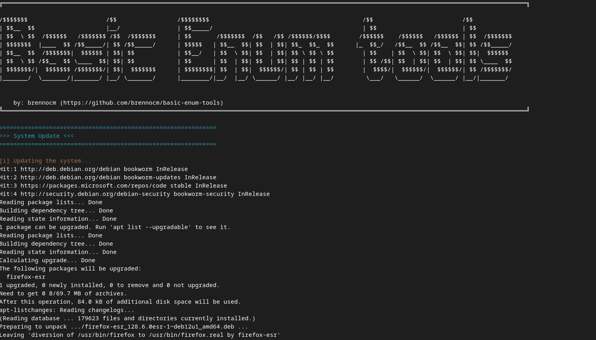

<div align="center">
    
    <h2 align="center"> Basic Enum Tools - Automating enumeration/reconnaissance environment setup</h2>
</div>

Script designed to automate the installation and configuration of tools for subdomain enumeration, endpoint resolution, URL crawling, fuzzing, and security testing automation.

### Features

- System update and installation of essential dependencies;
- Installation and configurations of programming languages (Python & Golang) and  tools.

##### Programming languages 
*   `python`: A high-level programming language, interpreted, scripting, imperative, object-oriented, functional, dynamically and strongly typed;
*   `golang`: A compiled language focused on productivity and concurrent programming.

##### General Utilities (Installed via `apt`)
*   `unzip`: ZIP file extraction;
*   `tar`: TAR file manipulation (compression and extraction);
*   `bzip2`: BZIP2 file manipulation (compression and extraction);
*   `vim`: An advanced text editor;
*   `curl`: A Data transfer tool via URL;
*   `git`: a Distributed version control system;
*   `net-tools`: A suite of network tools (includes `netstat`);
*   `python3-pip`: A package manager for Python3;
*   `python3-venv`: A tool to create Python virtual environments;
*   `jq`: A command-line JSON processor;
*   `nmap`: A network scanner;

#### Subdomain Enumeration Tools (Installed via `go install`)
*   `assetfinder`: Finds subdomains related to a target domain;
*   `subfinder`: Enumerates subdomains, focused on different data sources;
*   `anew`: Filters and maintains text lists without duplicates;
*   `amass`: A tool for open-source intelligence gathering, including subdomains;
*   `findomain`: A tool to find subdomains.

#### Subdomain Resolution Tools (Installed via `go install`)
*   `httpx`: A multi-purpose tool for probing web servers and identifying status codes;
*   `httprobe`: Checks if a list of hosts responds to the desired HTTP(S);
*   `gowitness`: A tool for taking screenshots of websites and storing them;
*   `dnsx`: A flexible tool for performing DNS queries.

#### Crawler Tools (Installed via `go install`)
*   `waybackurls`: Fetches URLs from the Wayback Machine for a domain;
*   `gau`: Fetches URLs from various sources of web indexers.

#### Endpoint Enumeration Tool (Installed via `go install`)
*   `gf`: Generates custom patterns for `grep` and other filters.

#### JavaScript Enumeration Tools (Installed via `go install`)
*   `subjs`: Finds JavaScript files in a list of URLs;
*   `anti-burl`: Filters based on HTTP 200 responses.

#### Directory Enumeration and Fuzzing Tools (Installed via `go install`)
*   `gobuster`: A tool for brute-forcing directories and files;
*   `ffuf`: A web fuzzing tool (finding files and directories).

#### Automation Tool (Installed via `go install`)
*   `nuclei`: A framework for performing automated vulnerability checks.

#### Additional Tools (Installed via `go install`)
*   `Goop`: A CVE search tool;
*   `meg`: Extracts information and data from texts;
*   `freq`: Identifies string and character frequencies;
*   `sdlookup`: Extracts subdomain information;
*   `sigurlfind3r`: Extracts URLs from files and text;
*   `airixss`: Identifies vulnerable XSS parameters;
*   `nilo`: Filters based on HTTP 200 responses;
*   Automatic template updates (e.g., Nuclei).

### How to Use?

<div align="center">
    
</div>

<br><br>

> ⚠️ **Warning:** Ensure the user has administrative permissions on the system.

<br>

 Clone this repository:
```bash
git clone https://github.com/brennocm/basic-enum-tools.git
```


Navigate to the project directory:
```bash
cd basic-enum-tools
```
Run the script using the `bash` utility with administrative permissions:
```bash
sudo bash basic-enum-tools.sh
```

#### OR 

Make the script executable:
```bash
chmod +x basic-enum-tools.sh
```

Run the script with administrative permissions:
```bash
sudo ./basic-enum-tools.sh
```
